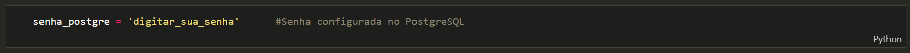

# Projeto Final - Engenharia Analitica
> *Turma 11080 - Santander Coders 2024 - Engenharia de Dados*

Desenvolvimento do projeto "Airbnb" com o intuito de extrair e trasformar dados do site [AirbnbInside](http://insideairbnb.com/) relacionado a hospedagem na cidade do rio de janeiro. Os dados serão carregados em banco de dados PostgreSQL e tratados utilizando DBT e Great Expectations para obtençãoo de insights de negócio na camada gold.

**Todo projeto foi desenvolvido com a linguagem de programação Python e framework Dbt.**

## ✒️Autores 
- [Alessandra Cruz](https://github.com/alessandracruz)
- [Álex Buracosky](https://github.com/aburacosk)
- [Diana Osorio](https://github.com/diana468)
- [Diogo Moura](https://github.com/HyogoMoura)
- [Felipe Zanardo](https://github.com/FelipeBZanardo)
- [Thiago Silva](https://github.com/thiagodemedeiros)

## 📓 Acesso aos arquivos utilizados como fonte de dados do projeto

- [Reviews](https://drive.google.com/file/d/1XTMhsYl_g5qpJq2V__FhDeRfauUPu18P/view?usp=drive_link)
- [Listings](https://drive.google.com/file/d/1DbXndz8ePvNSFf4Gsudhii5yYMMRfgxp/view?usp=drive_link)
- [Calendar](https://drive.google.com/file/d/1-pRla_tCidAQ744MFtX0YEEcpUXDf2DL/view?usp=drive_link)

## 🧾 Dicionário de Dados:

[Inside Airbnb Data Dictionary](https://docs.google.com/spreadsheets/d/1iWCNJcSutYqpULSQHlNyGInUvHg2BoUGoNRIGa6Szc4/edit?gid=1322284596#gid=1322284596)

## 📋 Enunciado do Projeto

Introdução à Base de Dados do Airbnb

O conjunto de dados "Inside Airbnb", disponível no website "http://insideairbnb.com/", é uma valiosa fonte de informações sobre listagens de hospedagem, avaliações de hóspedes e disponibilidade de calendário em várias cidades ao redor do mundo, incluindo o Rio de Janeiro. Antes de prosseguirmos com a engenharia de dados, é importante entender os principais componentes deste conjunto de dados:

1. **Listing (Listagem):** Este conjunto de dados contém informações detalhadas sobre as propriedades listadas no Airbnb. Cada registro representa uma listagem individual e inclui informações como o tipo de propriedade, preço, localização, número de quartos, comodidades oferecidas e muito mais.

2. **Reviews (Avaliações):** O conjunto de dados de avaliações contém informações sobre as avaliações feitas por hóspedes que ficaram nas propriedades listadas. Ele inclui dados como a data da avaliação, o identificador da propriedade, os comentários escritos pelos hóspedes, e outras informações.

3. **Calendar (Calendário):** Este conjunto de dados contém informações sobre a disponibilidade das propriedades ao longo do tempo. Ele lista as datas em que as propriedades estão disponíveis para reserva, bem como os preços para cada data.

O dicionário dos dados também está disponível no website: "http://insideairbnb.com/".

## 📝 Descrição do Projeto

1. **Aquisição de Dados e Armazenamento de Dados em PostgreSQL - Camada Bronze**
   - Baixe o conjunto de dados "Inside Airbnb" do Rio de Janeiro da fonte oficial (http://insideairbnb.com/) e promova uma estruturação simples nos dados.
   - Crie um banco de dados PostgreSQL para armazenar os dados brutos das 3 tabelas ("Listing", "Reviews" e Calendar") na camada "bronze".

2. **Data Clean - Camada Silver:**
   - Identifique e lide com valores ausentes, duplicatas e outliers nos dados brutos da camada "bronze".
   - Padronize e limpe os nomes das colunas, convertendo-os em um formato consistente.
   - Realize uma limpeza textual em campos, como descrições de propriedades, removendo caracteres especiais e erros de digitação.

3. **Data Quality - Camada Silver:**
   - Defina métricas de qualidade de dados, como integridade, precisão e consistência para os dados da camada "bronze".
   - Implemente verificações para garantir que os dados da camada "silver" estejam em conformidade com essas métricas.
   - Estabeleça um sistema de monitoramento contínuo da qualidade dos dados da camada "silver".

4. **Testes de Qualidade - Camada Silver:**
   - Utilize a biblioteca Great Expectations para criar testes de qualidade automatizados que verifiquem as expectativas definidas para os dados da camada "silver".
   - Desenvolva testes que assegurem que os dados da camada "silver" atendam às regras de negócios e aos requisitos de qualidade.

5. **Transformação de Dados com dbt - Camada Silver:**
   - Utilize a ferramenta dbt para criar a camada "silver" de dados, realizando transformações e preparando os dados da camada em questão.
   - Mantenha um controle de versão dos modelos dbt relacionados à camada "silver" e automatize a execução das transformações.

6. **Armazenamento de Dados em PostgreSQL - Camada Silver:**
   - Armazene os dados da camada "silver" no mesmo banco de dados PostgreSQL.
   - Estabeleça conexões entre o dbt e o PostgreSQL para carregar os dados transformados da camada "silver" no banco.

7. **Validação de Expectativas com Great Expectations - Camada Silver:**
   - Implemente validações adicionais usando Great Expectations nas camadas de dados da camada "silver".
   - Monitore a qualidade dos dados da camada "silver" após cada transformação e ajuste os testes de acordo.

8. **Transformação de Dados com dbt - Camada Gold:**
   - Utilize o dbt para criar a camada "gold" de dados, aplicando agregações especializadas, como médias de preços por propriedade, por período, e outras agregações especializadas.
   - Mantenha um controle de versão dos modelos dbt relacionados à camada "gold" e automatize a execução das transformações.
   - Armazene os dados da camada "gold" no mesmo banco de dados PostgreSQL, mantendo a estrutura de dados otimizada para consultas analíticas.

 9. **Apresentação e Discussão:**
    - Apresente os resultados do projeto para a turma, enfatizando os aspectos de engenharia de dados, qualidade de dados e uso de ferramentas como dbt, Great Expectations e o armazenamento em um banco de dados PostgreSQL nas camadas "bronze", "silver" e "gold".

## 📺 Demonstração

## ☑️  Pré-requisitos
- Ter o DBT instalado;
- Ter o PostgreSQL instalado de preferência versão 10 ou superior;
- Configurar a engine de acesso com a senha do PostgreSQL;
- Ajustar o profile.yml para o acesso ao banco local;

## ⚙️ Passo a passo para executar o projeto:

1. Clone desse projeto;
2. Abrir o projeto no VS Code;
3. Fazer o download dos 3 [arquivos.csv](#-acesso-aos-arquivos-utilizados-como-fonte-de-dados-do-projeto)
4. Alterar a senha do PostgreSQL que você configurou ao instalá-lo no arquivo 'projeto_analytics_engineering.ipynb':

  

5. Inicializar o notebook 'projeto_analytics_engineering.ipynb' com 'Run All'; 
**Esse processo demora quase uma hora para ser realizado devido a intensa quantidade de dados.**
6. Abrir o terminar no VS Code com o atalho <Ctrl + '>;
7. Acessar o diretório 'airbnb_project' com o comando <cd airbnb_project>;
8. Rodar todos os arquivos SQL e testes do Great Expectations com o comando <dbt build>;
9. Verificar todas as tables e views persistidas no PostgreSQL.

>**Assistir o vídeo de demonstração do projeto!**

## 🛠️ Tecnologias Utilizadas

* [Python](https://www.python.org/) - Linguagem de Programação
* [Postgres](https://www.postgresql.org/)) - Gerenciador de banco de dados
* [dbt](https://www.getdbt.com/)) - Framework de trasformacao de dados
* [Great Expectation](https://greatexpectations.io/) - Qualidade e testes de dados
* [VS Code](https://code.visualstudio.com/) - IDE

## 🚨 Dificuldades
-  Configurar todo o ambiente de trabalho, seja o Postgres, o DBT e o Great Expectations;
-  SQL, pois infelizmente não faz parte da ementa do curso.
-  Saber qual teste de qualidade usar, já que existe uma enorme variedade no Great Expectations.
-  Processo demorado na persistência dos dados.

## 📈 Melhorias futuras:
- Aumentar a base de dados para extração de mais insights de negócio;
- Utilizar um banco de dados presente em nuvem para não precisar configurar o PostgreSQL localmente.

